# Training Agent V1 — Database Schema Overview

## 1. 스키마 상태

현재 SQLite 데이터베이스에는 총 39개의 테이블이 존재한다.

| 영역              |  테이블 수 |
| --------------- | -----: |
| 시스템 및 원본 메시지    |      3 |
| 운동 사전·장소·사용자 조건 |     11 |
| 프로그램 및 예정 훈련    |      8 |
| 실제 훈련 기록        |      9 |
| 목표·추천·회복 관측     |      8 |
| **총합**          | **39** |

현재 구현된 마이그레이션은 다음과 같다.

```text
001_core.sql
002_catalog_profile.sql
003_planning.sql
004_actual_training.sql
005_targets_recommendations_observations.sql
```

---

# 2. 전체 설계 원칙

Training Agent의 데이터 구조는 다음 원칙을 따른다.

1. 계획과 실제 수행 기록은 분리한다.
2. 세션은 프로그램에 종속되지 않는다.
3. 프로그램은 블록의 선택적 출처로 연결한다.
4. 한 세션 안에 여러 프로그램의 블록이 들어갈 수 있다.
5. 실제 블록은 하나 이상의 예정 블록과 연결될 수 있다.
6. 운동 이름은 표준 운동 사전에 연결한다.
7. 장소와 장비는 분리해서 관리한다.
8. 운동 능력과 일시적인 제한은 분리한다.
9. 주간 목표와 실제 수행량을 비교해 추천을 생성한다.
10. 추천은 사용자 승인 후에만 예정 훈련으로 저장한다.
11. 훈련 사실과 회복·근육통 같은 관측값은 분리한다.
12. 향후 개인화 계산 결과는 원본 기록과 분리된 파생 데이터로 관리한다.

---

# 3. 최상위 데이터 흐름

```text
Discord 메시지
    │
    ▼
source_messages
    │
    ├── 계획 입력
    ├── 실제 훈련 기록
    ├── 선호도·능력·제한 변경
    ├── 회복·근육통 입력
    └── 추천 요청
```

```text
운동 사전·사용자 조건
    │
    ├── exercises
    ├── locations / equipment
    ├── exercise_preferences
    ├── exercise_capabilities
    └── exercise_restrictions
    │
    ▼
예정 훈련
    │
    ├── planned_sessions
    ├── planned_blocks
    └── planned_exercises / planned_metcons
    │
    ▼
실제 훈련
    │
    ├── workout_sessions
    ├── workout_blocks
    ├── exercise_sets
    ├── metcon_results
    └── cardio_results
    │
    ▼
주간 분석
    │
    ├── training_targets
    ├── 실제 수행량
    └── 남은 예정량
    │
    ▼
추천
    │
    ├── recommendation_batches
    └── recommendation_items
    │
    ▼
승인된 추천
    │
    └── planned_blocks로 저장
```

---

# 4. 시스템 및 원본 메시지

## `schema_migrations`

적용된 SQL 마이그레이션을 기록한다.

```text
schema_migrations
├── version
├── filename
├── checksum
└── applied_at
```

역할:

* 어떤 마이그레이션이 적용됐는지 확인
* 동일 마이그레이션의 중복 적용 방지
* 이미 적용된 SQL 파일이 수정됐는지 감지

---

## `users`

Training Agent 사용자 정보다.

```text
users
├── id
├── discord_user_id
├── display_name
├── timezone
├── created_at
└── updated_at
```

주요 관계:

```text
users 1 ─── N source_messages
users 1 ─── N locations
users 1 ─── N program_runs
users 1 ─── N planned_sessions
users 1 ─── N workout_sessions
users 1 ─── N training_targets
```

---

## `source_messages`

기록과 변경의 원본이 된 Discord 메시지를 저장한다.

```text
source_messages
├── id
├── discord_message_id
├── discord_channel_id
├── user_id
├── message_text
└── received_at
```

연결 가능한 대상:

* 예정 세션
* 예정 블록
* 실제 세션
* 실제 블록
* 운동 제한
* 회복 체크인
* 근육 상태 관측
* 수행능력 관측
* 추천 요청

목적:

> 특정 데이터가 어떤 Discord 메시지로부터 생성됐는지 추적한다.

---

# 5. 운동 사전

## `exercises`

모든 운동의 표준 사전이다.

```text
exercises
├── id
├── canonical_name
├── korean_name
├── category
├── default_block_type
├── is_active
├── notes
├── created_at
└── updated_at
```

예:

```text
Back Squat
Bench Press
Pull-up
Thruster
Running
Chest Supported Row
```

---

## `exercise_aliases`

여러 표현을 하나의 표준 운동에 연결한다.

```text
exercise_aliases
├── id
├── exercise_id
├── alias
├── alias_normalized
├── language
└── created_at
```

관계:

```text
exercises 1 ─── N exercise_aliases
```

예:

```text
백스쿼트 ─┐
백 스쿼트 ├── Back Squat
BS       ┤
Back squat ┘
```

---

## `movement_patterns`

V1 분석에 사용하는 움직임 패턴 사전이다.

```text
movement_patterns
├── id
├── code
├── display_name
├── description
└── created_at
```

기본 패턴:

```text
squat
hinge
horizontal_push
horizontal_pull
vertical_push
vertical_pull
knee_flexion
carry
locomotion
jump
core
other
```

---

## `exercise_movement_patterns`

운동과 움직임 패턴의 다대다 연결이다.

```text
exercise_movement_patterns
├── exercise_id
├── movement_pattern_id
├── role
└── contribution_weight
```

관계:

```text
exercises N ─── M movement_patterns
```

예:

```text
Thruster
├── squat
└── vertical_push

Clean
├── hinge
└── squat
```

`role`:

```text
primary
secondary
stabilizer
```

---

# 6. 장비와 장소

## `equipment`

장비 표준 사전이다.

```text
equipment
├── id
├── code
├── display_name
├── category
├── notes
├── is_active
├── created_at
└── updated_at
```

예:

```text
barbell
squat_rack
dumbbell
pullup_bar
cable_machine
rower
ski_erg
assault_bike
rings
climbing_rope
```

---

## `exercise_equipment`

운동 수행에 필요한 장비를 연결한다.

```text
exercise_equipment
├── exercise_id
├── equipment_id
├── is_required
├── quantity_required
└── notes
```

관계:

```text
exercises N ─── M equipment
```

예:

```text
Back Squat
├── barbell
└── squat_rack
```

---

## `locations`

사용자의 훈련 장소다.

```text
locations
├── id
├── user_id
├── name
├── location_type
├── notes
├── is_active
├── created_at
└── updated_at
```

`location_type`:

```text
home_gym
commercial_gym
crossfit_box
outdoor
temporary_location
other
```

관계:

```text
users 1 ─── N locations
```

---

## `location_equipment`

각 장소에 존재하는 장비를 저장한다.

```text
location_equipment
├── location_id
├── equipment_id
├── quantity
├── minimum_weight
├── maximum_weight
├── weight_unit
└── notes
```

관계:

```text
locations N ─── M equipment
```

이 테이블을 이용해 추천 엔진은 다음을 검사한다.

```text
현재 장소
→ 장비 목록 조회
→ 추천 운동에 필요한 장비 확인
→ 수행 불가능한 운동 제외
```

---

# 7. 사용자 운동 프로필

## `exercise_preferences`

사용자의 운동 선호도다.

```text
exercise_preferences
├── user_id
├── exercise_id
├── preference_score
├── reason
├── context
└── updated_at
```

점수:

```text
 2 매우 선호
 1 선호
 0 중립
-1 비선호
-2 적극 회피
```

관계:

```text
users N ─── M exercises
```

선호도는 추천 후보를 제거하는 하드 조건이 아니라 추천 순서를 조정하는 소프트 조건이다.

---

## `exercise_capabilities`

사용자의 운동 수행 능력이다.

```text
exercise_capabilities
├── user_id
├── exercise_id
├── status
├── skill_level
├── max_unbroken_reps
├── max_weight
├── weight_unit
├── notes
└── updated_at
```

`status`:

```text
available
learning
scaled_only
restricted
unavailable
unknown
```

예:

```text
Ring Muscle-up: unavailable
Rope Climb: scaled_only
Handstand Walk: learning
Back Squat: available
```

---

## `exercise_restrictions`

부상·통증 등에 의한 일시적 제한이다.

```text
exercise_restrictions
├── id
├── user_id
├── exercise_id
├── movement_pattern_id
├── restriction_level
├── status
├── reason
├── starts_on
├── expected_end_on
├── resolved_at
├── notes
├── source_message_id
├── created_at
└── updated_at
```

제한 대상은 다음 중 하나 이상이다.

```text
특정 운동
또는
특정 움직임 패턴
```

`restriction_level`:

```text
avoid
limit
modify
```

`status`:

```text
active
review_required
resolved
```

운동 수행 능력과 일시적인 제한은 별도로 관리한다.

```text
Ring Muscle-up을 아직 못함
→ exercise_capabilities

어깨 통증으로 딥스를 2주 제한
→ exercise_restrictions
```

---

# 8. 프로그램 구조

## `programs`

프로그램 자체의 정의다.

```text
programs
├── id
├── name
├── provider
├── program_type
├── version_label
├── description
├── notes
├── is_active
├── created_at
└── updated_at
```

예:

```text
HWPO Flagship
Mayhem Athlete
MyoAdapt Hypertrophy
개인 근비대 프로그램
```

---

## `program_runs`

사용자가 특정 프로그램을 실제로 진행하는 기간이다.

```text
program_runs
├── id
├── user_id
├── program_id
├── status
├── started_on
├── ended_on
├── current_week
├── notes
├── created_at
└── updated_at
```

관계:

```text
users 1 ─── N program_runs
programs 1 ─── N program_runs
```

같은 프로그램을 중단했다가 다시 시작하면 별도의 `program_run`을 생성한다.

---

# 9. 예정 훈련

## `planned_sessions`

특정 날짜·시간·장소의 예정 훈련 세션이다.

```text
planned_sessions
├── id
├── user_id
├── location_id
├── session_date
├── planned_start_time
├── planned_end_time
├── title
├── status
├── notes
├── rescheduled_from_session_id
├── source_message_id
├── created_at
├── updated_at
└── deleted_at
```

관계:

```text
users 1 ─── N planned_sessions
locations 1 ─── N planned_sessions
planned_sessions 1 ─── N planned_blocks
```

프로그램과는 직접 연결하지 않는다.

---

## `planned_blocks`

예정 세션 안의 개별 훈련 블록이다.

```text
planned_blocks
├── id
├── planned_session_id
├── sequence
├── title
├── block_type
├── training_goal
├── status
├── estimated_duration_minutes
├── prescription_text
├── notes
├── source_message_id
├── created_at
├── updated_at
└── deleted_at
```

관계:

```text
planned_sessions 1 ─── N planned_blocks
```

예:

```text
2026-07-23 박스 세션
├── Block 1: HWPO Back Squat
├── Block 2: Mayhem Metcon
└── Block 3: 개인 등 근비대
```

---

## `planned_block_program_runs`

예정 블록과 진행 중인 프로그램의 다대다 연결이다.

```text
planned_block_program_runs
├── planned_block_id
├── program_run_id
├── source_role
├── source_reference
├── notes
└── created_at
```

관계:

```text
planned_blocks N ─── M program_runs
```

`source_role`:

```text
primary
supplemental
inspired_by
modified_from
```

중요한 특성:

* 프로그램 없는 블록도 존재할 수 있다.
* 한 세션 안에 여러 프로그램의 블록이 들어갈 수 있다.
* 하나의 블록이 여러 프로그램을 참고할 수 있다.

---

## `planned_exercises`

예정된 저항운동·스킬·일반 운동 처방이다.

```text
planned_exercises
├── id
├── planned_block_id
├── exercise_id
├── sequence
├── group_label
├── sets
├── reps_min
├── reps_max
├── weight
├── weight_unit
├── percentage_1rm
├── target_rpe
├── target_rir
├── duration_seconds
├── distance_meters
├── calories
├── rest_seconds
├── tempo
├── prescription_text
├── notes
├── created_at
└── updated_at
```

관계:

```text
planned_blocks 1 ─── N planned_exercises
exercises 1 ─── N planned_exercises
```

---

## `planned_metcons`

예정된 메트콘의 전체 구조다.

```text
planned_metcons
├── id
├── planned_block_id
├── format
├── score_type
├── rounds
├── time_cap_seconds
├── work_interval_seconds
├── rest_interval_seconds
├── prescription_text
├── notes
├── created_at
└── updated_at
```

관계:

```text
planned_blocks 1 ─── 0..1 planned_metcons
```

---

## `planned_metcon_movements`

예정 메트콘 안의 주요 동작이다.

```text
planned_metcon_movements
├── id
├── planned_metcon_id
├── exercise_id
├── sequence
├── round_number
├── reps
├── distance_meters
├── calories
├── weight
├── weight_unit
├── notes
└── created_at
```

관계:

```text
planned_metcons 1 ─── N planned_metcon_movements
exercises 1 ─── N planned_metcon_movements
```

---

# 10. 실제 훈련

## `workout_sessions`

실제로 수행한 한 번의 훈련 세션이다.

```text
workout_sessions
├── id
├── user_id
├── location_id
├── performed_on
├── started_at
├── ended_at
├── title
├── status
├── overall_rpe
├── condition_score
├── notes
├── source_message_id
├── created_at
├── updated_at
└── deleted_at
```

관계:

```text
users 1 ─── N workout_sessions
locations 1 ─── N workout_sessions
workout_sessions 1 ─── N workout_blocks
```

계획 없이 실제 세션만 생성할 수도 있다.

---

## `workout_blocks`

실제 세션 안에서 수행한 훈련 블록이다.

```text
workout_blocks
├── id
├── workout_session_id
├── sequence
├── title
├── block_type
├── training_goal
├── status
├── result_text
├── notes
├── source_message_id
├── created_at
├── updated_at
└── deleted_at
```

관계:

```text
workout_sessions 1 ─── N workout_blocks
```

---

## `workout_block_planned_blocks`

실제 블록과 예정 블록을 연결한다.

```text
workout_block_planned_blocks
├── workout_block_id
├── planned_block_id
├── relation_type
├── notes
└── created_at
```

관계:

```text
workout_blocks N ─── M planned_blocks
```

`relation_type`:

```text
exact
modified
substituted
combined
derived_from
```

예:

```text
예정 백스쿼트 블록
→ 실제 수행: exact

예정 풀업
→ 실제 수행: 링로우
→ substituted

예정 블록 두 개를 합쳐서 수행
→ combined
```

---

## `workout_block_program_runs`

실제 블록과 프로그램 진행 이력을 연결한다.

```text
workout_block_program_runs
├── workout_block_id
├── program_run_id
├── source_role
├── source_reference
├── notes
└── created_at
```

관계:

```text
workout_blocks N ─── M program_runs
```

실제 블록은 예정 블록 없이도 프로그램과 직접 연결될 수 있다.

---

## `workout_exercises`

실제 블록 안에서 수행한 운동이다.

```text
workout_exercises
├── id
├── workout_block_id
├── exercise_id
├── sequence
├── group_label
├── variation_text
├── notes
├── source_message_id
├── created_at
└── updated_at
```

관계:

```text
workout_blocks 1 ─── N workout_exercises
exercises 1 ─── N workout_exercises
```

---

## `exercise_sets`

실제 수행한 개별 세트다.

```text
exercise_sets
├── id
├── workout_exercise_id
├── set_number
├── set_type
├── reps
├── load_value
├── load_unit
├── load_type
├── duration_seconds
├── distance_meters
├── calories
├── rpe
├── rir
├── is_failure
├── completed
├── notes
├── created_at
└── updated_at
```

관계:

```text
workout_exercises 1 ─── N exercise_sets
```

`set_type`:

```text
warmup
working
backoff
drop
test
technique
unknown
```

---

## `metcon_results`

실제 메트콘의 전체 결과다.

```text
metcon_results
├── id
├── workout_block_id
├── format
├── score_type
├── time_seconds
├── rounds_completed
├── reps_completed
├── load_value
├── load_unit
├── distance_meters
├── calories
├── time_cap_seconds
├── completed_within_cap
├── rx_status
├── result_text
├── notes
├── created_at
└── updated_at
```

관계:

```text
workout_blocks 1 ─── 0..1 metcon_results
```

---

## `metcon_movement_results`

실제 메트콘에서 수행한 운동별 총량이다.

```text
metcon_movement_results
├── id
├── metcon_result_id
├── exercise_id
├── sequence
├── total_reps
├── distance_meters
├── calories
├── load_value
├── load_unit
├── modification_text
├── notes
└── created_at
```

관계:

```text
metcon_results 1 ─── N metcon_movement_results
exercises 1 ─── N metcon_movement_results
```

예:

```text
Fran
├── Thruster: 45회, 95lb
└── Pull-up: 45회
```

---

## `cardio_results`

실제 카디오 수행 결과다.

```text
cardio_results
├── id
├── workout_block_id
├── exercise_id
├── duration_seconds
├── distance_meters
├── average_pace_seconds_per_km
├── average_speed_kph
├── average_heart_rate
├── maximum_heart_rate
├── intensity_zone
├── elevation_gain_meters
├── intervals_text
├── notes
├── created_at
└── updated_at
```

관계:

```text
workout_blocks 1 ─── 0..1 cardio_results
exercises 1 ─── N cardio_results
```

---

# 11. 목표

## `training_targets`

사용자의 기간별 훈련 목표다.

```text
training_targets
├── id
├── user_id
├── name
├── scope_type
├── movement_pattern_id
├── exercise_id
├── block_type
├── metric_type
├── minimum_value
├── target_value
├── maximum_value
├── period_type
├── priority
├── valid_from
├── valid_until
├── is_active
├── notes
├── created_at
└── updated_at
```

목표 범위:

```text
movement_pattern
exercise
block_type
```

측정 기준:

```text
effective_sets
exposure_count
frequency
duration_minutes
distance_meters
```

예:

```text
수평 당기기 주간 유효 세트
minimum: 8
target: 10
maximum: 14
```

---

# 12. 추천

## `recommendation_batches`

한 번의 분석 요청에서 생성된 추천 묶음이다.

```text
recommendation_batches
├── id
├── user_id
├── week_start
├── week_end
├── requested_location_id
├── status
├── analysis_snapshot_json
├── notes
├── source_message_id
├── expires_at
├── created_at
└── updated_at
```

관계:

```text
users 1 ─── N recommendation_batches
locations 1 ─── N recommendation_batches
recommendation_batches 1 ─── N recommendation_items
```

---

## `recommendation_items`

추천 묶음 안의 개별 운동 추천이다.

```text
recommendation_items
├── id
├── recommendation_batch_id
├── rank
├── exercise_id
├── movement_pattern_id
├── training_target_id
├── location_id
├── status
├── deficit_metric_type
├── deficit_value
├── proposed_sets
├── proposed_reps_min
├── proposed_reps_max
├── proposed_duration_seconds
├── proposed_distance_meters
├── proposed_load_value
├── proposed_load_unit
├── rationale
├── excluded_alternatives_json
├── constraints_snapshot_json
├── confidence
├── created_planned_block_id
├── created_at
└── updated_at
```

상태:

```text
proposed
approved
rejected
scheduled
expired
```

관계:

```text
recommendation_items N ─── 1 exercises
recommendation_items N ─── 0..1 movement_patterns
recommendation_items N ─── 0..1 training_targets
recommendation_items N ─── 0..1 locations
recommendation_items N ─── 0..1 planned_blocks
```

승인 흐름:

```text
recommendation_items.status = proposed
    │
    ▼ 사용자 승인
recommendation_items.status = approved
    │
    ▼ 예정 블록 생성
planned_blocks
    │
    ▼
recommendation_items.status = scheduled
recommendation_items.created_planned_block_id 저장
```

---

# 13. 미래 개인화를 위한 관측값

## `muscle_groups`

근육군 표준 사전이다.

```text
muscle_groups
├── id
├── code
├── display_name
├── description
└── created_at
```

기본 근육군:

```text
quads
hamstrings
glutes
calves
chest
lats
upper_back
front_delts
side_delts
rear_delts
triceps
biceps
forearms_grip
spinal_erectors
abdominals
other
```

---

## `recovery_checkins`

사용자의 전반적인 회복 상태다.

```text
recovery_checkins
├── id
├── user_id
├── recorded_at
├── reference_date
├── overall_fatigue
├── sleep_quality
├── energy_level
├── motivation
├── stress_level
├── notes
├── source_message_id
├── created_at
└── updated_at
```

점수 범위:

```text
1~5
```

---

## `muscle_status_observations`

근육별 근육통·피로·통증·뻣뻣함 관측값이다.

```text
muscle_status_observations
├── id
├── user_id
├── muscle_group_id
├── recorded_at
├── soreness_score
├── fatigue_score
├── pain_score
├── stiffness_score
├── laterality
├── notes
├── source_message_id
└── created_at
```

관계:

```text
users 1 ─── N muscle_status_observations
muscle_groups 1 ─── N muscle_status_observations
```

근육통과 통증은 별도 값으로 저장한다.

```text
soreness_score
→ 운동 후 근육통

pain_score
→ 부상·관절·힘줄 가능성이 있는 통증
```

---

## `observation_workout_links`

근육 상태 관측과 이전 훈련 세션의 선택적 연결이다.

```text
observation_workout_links
├── observation_id
├── workout_session_id
├── attribution_type
├── attribution_weight
├── notes
└── created_at
```

관계:

```text
muscle_status_observations N ─── M workout_sessions
```

`attribution_type`:

```text
temporal
self_reported
model_inferred
unknown
```

근육통을 특정 운동 하나의 결과로 성급하게 단정하지 않기 위해 선택적 다대다 관계를 사용한다.

---

## `performance_observations`

운동 수행능력의 명시적 또는 파생 관측값이다.

```text
performance_observations
├── id
├── user_id
├── exercise_id
├── workout_session_id
├── workout_block_id
├── observed_at
├── metric_type
├── metric_value
├── metric_unit
├── is_derived
├── calculation_version
├── confidence
├── notes
├── source_message_id
└── created_at
```

`metric_type`:

```text
estimated_1rm
max_unbroken_reps
working_weight
time_seconds
pace_seconds_per_km
rounds
reps_completed
set_dropoff_percent
other
```

관계:

```text
users 1 ─── N performance_observations
exercises 1 ─── N performance_observations
workout_sessions 1 ─── N performance_observations
workout_blocks 1 ─── N performance_observations
```

---

# 14. 전체 관계도

```mermaid
erDiagram
    USERS ||--o{ SOURCE_MESSAGES : creates
    USERS ||--o{ LOCATIONS : owns
    USERS ||--o{ PROGRAM_RUNS : follows
    USERS ||--o{ PLANNED_SESSIONS : plans
    USERS ||--o{ WORKOUT_SESSIONS : performs
    USERS ||--o{ TRAINING_TARGETS : defines
    USERS ||--o{ RECOMMENDATION_BATCHES : requests
    USERS ||--o{ RECOVERY_CHECKINS : records
    USERS ||--o{ MUSCLE_STATUS_OBSERVATIONS : records
    USERS ||--o{ PERFORMANCE_OBSERVATIONS : records

    EXERCISES ||--o{ EXERCISE_ALIASES : has
    EXERCISES ||--o{ EXERCISE_MOVEMENT_PATTERNS : maps
    MOVEMENT_PATTERNS ||--o{ EXERCISE_MOVEMENT_PATTERNS : classifies

    EXERCISES ||--o{ EXERCISE_EQUIPMENT : requires
    EQUIPMENT ||--o{ EXERCISE_EQUIPMENT : used_by

    LOCATIONS ||--o{ LOCATION_EQUIPMENT : contains
    EQUIPMENT ||--o{ LOCATION_EQUIPMENT : available_at

    USERS ||--o{ EXERCISE_PREFERENCES : sets
    EXERCISES ||--o{ EXERCISE_PREFERENCES : preferred

    USERS ||--o{ EXERCISE_CAPABILITIES : has
    EXERCISES ||--o{ EXERCISE_CAPABILITIES : capability_for

    USERS ||--o{ EXERCISE_RESTRICTIONS : has
    EXERCISES ||--o{ EXERCISE_RESTRICTIONS : restricted_exercise
    MOVEMENT_PATTERNS ||--o{ EXERCISE_RESTRICTIONS : restricted_pattern

    PROGRAMS ||--o{ PROGRAM_RUNS : instantiated_as

    LOCATIONS ||--o{ PLANNED_SESSIONS : scheduled_at
    PLANNED_SESSIONS ||--o{ PLANNED_BLOCKS : contains

    PLANNED_BLOCKS ||--o{ PLANNED_BLOCK_PROGRAM_RUNS : sourced_from
    PROGRAM_RUNS ||--o{ PLANNED_BLOCK_PROGRAM_RUNS : supplies

    PLANNED_BLOCKS ||--o{ PLANNED_EXERCISES : prescribes
    EXERCISES ||--o{ PLANNED_EXERCISES : planned_as

    PLANNED_BLOCKS ||--o| PLANNED_METCONS : defines
    PLANNED_METCONS ||--o{ PLANNED_METCON_MOVEMENTS : contains
    EXERCISES ||--o{ PLANNED_METCON_MOVEMENTS : movement

    LOCATIONS ||--o{ WORKOUT_SESSIONS : performed_at
    WORKOUT_SESSIONS ||--o{ WORKOUT_BLOCKS : contains

    WORKOUT_BLOCKS ||--o{ WORKOUT_BLOCK_PLANNED_BLOCKS : fulfills
    PLANNED_BLOCKS ||--o{ WORKOUT_BLOCK_PLANNED_BLOCKS : fulfilled_by

    WORKOUT_BLOCKS ||--o{ WORKOUT_BLOCK_PROGRAM_RUNS : sourced_from
    PROGRAM_RUNS ||--o{ WORKOUT_BLOCK_PROGRAM_RUNS : supplies

    WORKOUT_BLOCKS ||--o{ WORKOUT_EXERCISES : contains
    EXERCISES ||--o{ WORKOUT_EXERCISES : performed_as
    WORKOUT_EXERCISES ||--o{ EXERCISE_SETS : has

    WORKOUT_BLOCKS ||--o| METCON_RESULTS : produces
    METCON_RESULTS ||--o{ METCON_MOVEMENT_RESULTS : contains
    EXERCISES ||--o{ METCON_MOVEMENT_RESULTS : movement

    WORKOUT_BLOCKS ||--o| CARDIO_RESULTS : produces
    EXERCISES ||--o{ CARDIO_RESULTS : cardio_type

    MOVEMENT_PATTERNS ||--o{ TRAINING_TARGETS : target_pattern
    EXERCISES ||--o{ TRAINING_TARGETS : target_exercise

    RECOMMENDATION_BATCHES ||--o{ RECOMMENDATION_ITEMS : contains
    EXERCISES ||--o{ RECOMMENDATION_ITEMS : recommends
    MOVEMENT_PATTERNS ||--o{ RECOMMENDATION_ITEMS : fills
    TRAINING_TARGETS ||--o{ RECOMMENDATION_ITEMS : satisfies
    LOCATIONS ||--o{ RECOMMENDATION_ITEMS : performed_at
    PLANNED_BLOCKS ||--o{ RECOMMENDATION_ITEMS : created_from

    MUSCLE_GROUPS ||--o{ MUSCLE_STATUS_OBSERVATIONS : observed
    MUSCLE_STATUS_OBSERVATIONS ||--o{ OBSERVATION_WORKOUT_LINKS : linked_to
    WORKOUT_SESSIONS ||--o{ OBSERVATION_WORKOUT_LINKS : possible_source

    EXERCISES ||--o{ PERFORMANCE_OBSERVATIONS : measured
    WORKOUT_SESSIONS ||--o{ PERFORMANCE_OBSERVATIONS : observed_in
    WORKOUT_BLOCKS ||--o{ PERFORMANCE_OBSERVATIONS : observed_in
```



---

# 15. 핵심 관계 요약

## 프로그램과 계획

```text
programs
    │
    ▼
program_runs
    │
    ▼
planned_block_program_runs
    │
    ▼
planned_blocks
    │
    ▼
planned_sessions
```

프로그램은 세션의 부모가 아니다.

---

## 계획과 실제 수행

```text
planned_sessions
    │
planned_blocks
    │
workout_block_planned_blocks
    │
workout_blocks
    │
workout_sessions
```

계획과 실제는 독립적으로 존재하며 연결 테이블을 통해 비교한다.

---

## 실제 저항운동

```text
workout_sessions
    │
workout_blocks
    │
workout_exercises
    │
exercise_sets
```

---

## 실제 메트콘

```text
workout_sessions
    │
workout_blocks
    │
metcon_results
    │
metcon_movement_results
```

---

## 실제 카디오

```text
workout_sessions
    │
workout_blocks
    │
cardio_results
```

---

## 장소 기반 추천

```text
locations
    │
location_equipment
    │
equipment
    │
exercise_equipment
    │
exercises
```

---

## 사용자 조건 기반 추천

```text
exercises
    │
    ├── exercise_preferences
    ├── exercise_capabilities
    └── exercise_restrictions
```

---

## 부족량과 추천

```text
training_targets
    │
실제 수행량 + 남은 예정량
    │
부족량 계산
    │
recommendation_batches
    │
recommendation_items
    │
사용자 승인
    │
planned_blocks
```

---

## 미래 개인화

```text
workout_sessions / workout_blocks
    │
    ├── recovery_checkins
    ├── muscle_status_observations
    ├── observation_workout_links
    └── performance_observations
    │
    ▼
향후 개인화 프로필 및 회복 모델
```

---

# 16. 현재 스키마에 포함되지 않은 향후 기능

현재 39개 테이블에는 다음 기능이 아직 포함되지 않거나 실제 동작이 구현되지 않았다.

* 사진 및 첨부파일 저장
* 이미지 분석 작업 이력
* 자연어 입력 임시 승인 상태
* 감사 로그와 되돌리기 이벤트
* 운동별 근육 기여도 기본 프로필
* 사용자별 운동-근육 개인 보정값
* 계산된 근육 부하 이벤트
* 자동 회복도 및 readiness 계산
* 알림 일정과 발송 이력
* 외부 서비스 동기화 이력

이 기능들은 필요해질 때 별도 마이그레이션으로 추가한다.

예:

```text
006_audit_pending_actions.sql
007_seed_catalog.sql
008_image_attachments.sql
009_personalization.sql
```

현재 적용된 마이그레이션 파일은 수정하지 않는다.

---

# 17. 현재 스키마 완성 상태

현재 데이터베이스는 다음 기능을 표현할 수 있다.

```text
[완료] 운동 표준 사전
[완료] 운동 별칭
[완료] 움직임 패턴
[완료] 장비 사전
[완료] 장소별 장비
[완료] 운동 선호도
[완료] 운동 수행 가능 여부
[완료] 일시적 운동 제한
[완료] 프로그램과 진행 이력
[완료] 예정 세션과 예정 블록
[완료] 프로그램과 블록의 선택적 다대다 연결
[완료] 예정 저항운동
[완료] 예정 메트콘
[완료] 실제 훈련 세션과 블록
[완료] 실제 운동 세트
[완료] 실제 메트콘 결과
[완료] 실제 카디오 결과
[완료] 계획과 실제 블록 연결
[완료] 주간 훈련 목표
[완료] 추천 결과와 승인 상태
[완료] 추천과 예정 블록 연결
[완료] 회복 체크인
[완료] 근육통·피로·통증 관측
[완료] 수행능력 변화 관측
```

따라서 V1의 데이터 구조 단계인 `V1-2`는 완료된 상태다.
